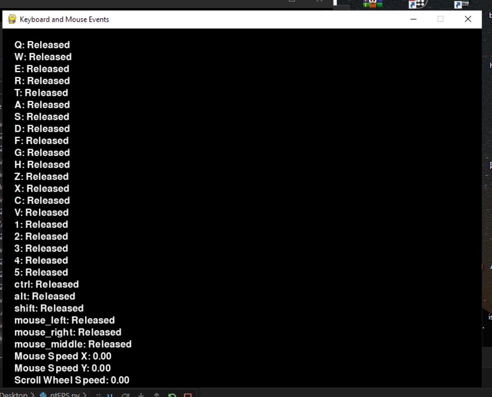
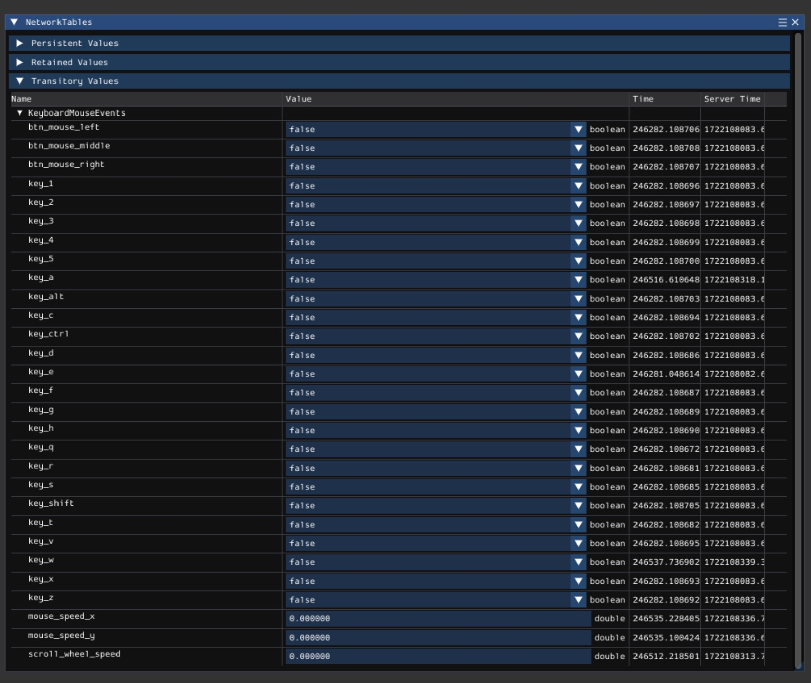

# A keyboard and mouse to networktables script

This tool send keyboard stroke (qwertasdfghzxcv12345) mouse stroke (left, right, middle) and mouse speed (X, Y and scroll wheel) to networktable server.

Press P key on the keyboard to pause capture and press P again to resume.

Pygame and robotpy is required to launch this. 

This code is partally generated by AI.